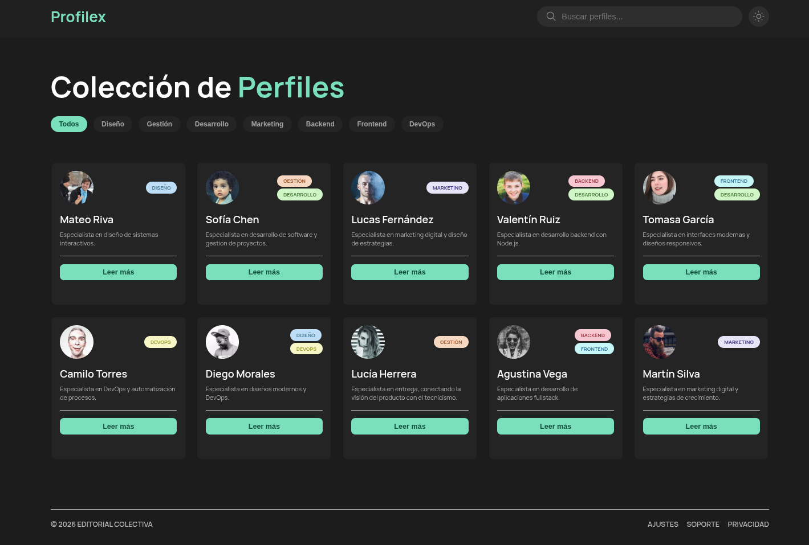

<div align="center">

# Profilex

Plataforma de tarjetas de perfiles interactivas.


</div>

---

## Descripción

Profilex es una aplicación web que permite explorar y descubrir perfiles de manera simple e intuitiva mediante tarjetas interactivas. Cada tarjeta muestra información básica de un perfil y permite expandir sus detalles con un solo click. La aplicación incluye filtrado en tiempo real por nombre y por categoría, además de soporte para modo claro y oscuro.

---

## Funcionalidades

| Feature | Descripción |
|---------|-------------|
| **Tarjetas expandibles** | Cada tarjeta puede mostrar u ocultar datos adicionales. Solo una puede estar abierta a la vez; al abrir otra, la anterior se cierra automáticamente. |
| **Filtrado por nombre** | El input de búsqueda filtra las tarjetas en tiempo real a medida que el usuario escribe. |
| **Filtrado por categoría** | Las pills permiten filtrar los perfiles por rol o área. Al seleccionar una, solo se muestran las tarjetas de esa categoría. |
| **Modo claro/oscuro** | El botón del header alterna entre ambos temas. La preferencia se guarda en localStorage y se mantiene al recargar la página. |
| **Renderizado dinámico** | Las tarjetas se generan desde un arreglo de objetos en JavaScript, sin necesidad de escribir HTML manual para cada perfil. |
| **Header fijo** | El header permanece visible en la parte superior mientras el usuario hace scroll hacia abajo. |

---

## Diseño

Para el diseño general de la aplicación se utilizó **Google Stitch**, trabajando de forma iterativa hasta alcanzar el resultado final deseado. A lo largo del proceso se fueron probando distintas disposiciones y estilos visuales para mejorar la experiencia de usuario.

En particular, para las **tarjetas de perfil** se trabajó en un archivo independiente donde se buscaron distintas formas de presentar la información, priorizando claridad, legibilidad y facilidad de interacción.

---

## Tecnologías utilizadas

- HTML5
- CSS3 (Flexbox, variables CSS, animaciones)
- JavaScript (módulos, DOM, localStorage)

---

## Estructura del proyecto

```
programacion-3-parcial/
├── assets/
│   ├── favicon/
│   │   └── icon.png
│   └── img/
│       ├── dark-preview.png
├── css/
│   ├── components/
│   │   ├── card.css
│   │   └── pills.css
│   ├── expand-cards.css
│   ├── index.css
│   └── main-section.css
├── js/
│   ├── data.js
│   ├── render-cards.js
│   ├── expand-cards.js
│   ├── filter-by-input.js
│   ├── filter-by-role.js
│   ├── toggle-light-mode.js
│   ├── floating-header.js
│   └── script.js
├── index.html
└── README.md
```

---

## Instalación y uso

### Opción 1 — GitHub Pages

El proyecto está desplegado y disponible en:

**[https://InakiCarcereny.github.io/programacion-3-parcial](https://InakiCarcereny.github.io/programacion-3-parcial)**

### Opción 2 — Local

No requiere instalación de dependencias ni servidor. Seguí estos pasos:

1. Cloná el repositorio:
   ```bash
   git clone https://github.com/InakiCarcereny/programacion-3-parcial.git
   ```

2. Entrá a la carpeta del proyecto:
   ```bash
   cd programacion-3-parcial
   ```

3. Abrí `index.html` en el navegador.

---

## Flujo de trabajo con Git

El proyecto usa **Git Flow** con las siguientes ramas:

| Rama | Descripción |
|------|-------------|
| `main` | Versión final de producción |
| `dev` | Integración de todas las features |
| `feature/*` | Nuevas funcionalidades |
| `refactor/*` | Reorganización de código sin cambios funcionales | 
| `style/*` | Cambios de estilos CSS |
| `fix/*` | Corrección de bugs |
| `docs/*` | Cambios en documentación |

### Convención de commits

| Prefijo | Uso |
|---------|-----|
| `feat:` | Nueva funcionalidad |
| `style:` | Cambios de CSS |
| `fix:` | Corrección de bug |
| `docs:` | Cambios en documentación |
| `refactor:` | Reorganización de código |

## Organización del trabajo

Para la planificación y organización del proyecto se utilizó un archivo separado donde se definió qué iba a hacer cada integrante y cómo lo iba a llevar a cabo. Además, en este documento se establecieron las **features** que se iban a implementar, facilitando la distribución de tareas.

---

## Integrantes - Grupo N-7

| Nombre |
|--------|
| Iñaki Carcereny |
| Valentín De Pascale |
| Joaquín Marcilese |
| Ezequiel Barrionuevo |
| Alan Axel Hansen |
